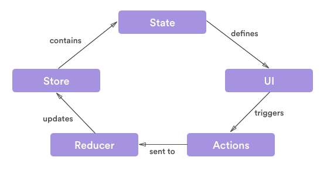

# redux 

## 리덕스란?
mvc패턴을 대체하기 위해서 패이스북이 사용한 Flux패턴을 살짝 바꾼거      
```
view->action->dispatcher->store(middleware->reducer)->view  
```
    
리덕스 패턴은 위와 같이 데이터의 흐림이 간다.   
한방향으로만 데이터가 흐르기 때문에 데이터의 흐름을 예측하기 쉽다.  
그래서 관리하기도 좋고 특히 함수형 프로그래밍을 따르기 때문에 데이터가 불변하여 
예측하기도 쉽고, 이전 상태로 되돌리기도 쉽다.   


## State
리덕스는 모든 것을 state로 관리 한다.   
위에서 말한 데이터가 state이다.     
React의 state 와는 좀 다르다.   
웹앱 전체의 상태를 관리하기 때문이다.   
각각의 컴포넌트는 리덕스에 저장된 state를 읽어와 사용한다.  


## 간단한 redux 사용 html
1. html 소스
    ```html
    <!DOCTYPE html>
    <html>
    <head>
    <meta charset="utf-8">
    <meta name="viewport" content="width=device-width">
    <title>그냥 평범한 리덕스</title>
    </head>
    <body>
    <h1 id="number">0</h1>
    <button id="increment">+</button>
    <button id="decrement">-</button>
    <script src="https://cdnjs.cloudflare.com/ajax/libs/redux/3.6.0/redux.js"></script>
    <script src="./ex1.js"></script>
    </body>
    </html>
    ```
2. 기본세팅....
    ```js
    // 편의를 위하여 각 DOM 엘리먼트에 대한 레퍼런스를 만들어줍니다.
    const elNumber = document.getElementById('number');
    const btnIncrement = document.getElementById('increment');
    const btnDecrement = document.getElementById('decrement');
    ```
3. 액션타입 지정
    ```js
    // 액션 타입을 정의해줍니다. 
    const INCREMENT = 'INCREMENT';
    const DECREMENT = 'DECREMENT';
    ```
4.  각 액션타입들을 위한 액션 생성 함수를 만들기
    액션 함수를 만드는 이유는 그때 그떄 액션을 만들 때마다 직접 {} 형식으로 객체를 일일이 생성하는 것이 번거럽기 때문
    ```js
    // 액션 객체를 만들어주는 액션 생성 함수
    const increment = (diff) => ({ type: INCREMENT, diff: diff });
    const decrement = () => ({ type: DECREMENT });
    ```
5. state 기본 값 설정
    ```js
    // 초기값을 설정합니다. 상태의 형태는 개발자 마음대로 입니다.
    const initialState = {
        number: 0
    };
    ```
6. 변화를 일으키는 함수 리듀서 정의 
    ```js
    
    // 이것은 리듀서 함수입니다.
    // state 와 action 을 파라미터로 받아옵니다.
    // 그리고 그에 따라 다음 상태를 정의 한 다음에 반환해줍니다.
    // 여기에 state = initialState 는, 파라미터의 기본값을 지정해줍니다.
    const counter = (state = initialState, action) => {
        console.log(action);
        switch(action.type) {
            case INCREMENT:
            return { 
                number: state.number + action.diff
            };
            case DECREMENT:
            return { 
                number: state.number - 1
            };
            default:
            return state;
        }
    }
    ```
7. 스토어 생성
    스토어를 만들 땐 createStore를 사용하여 만든다.     
    createStore에는 리듀서가 들어간다.  
    또는 스토어의 초기상태 그리고 미들웨어도 넣을 수 있다.
    ```js
    // 스토어를 만들 땐 createStore 에 리듀서 함수를 넣어서 호출합니다.
    const { createStore } = Redux;
    const store = createStore(counter);
    ```
8. 스토어에 변화가 생길때마다 실행시킬 리스너 함수 render를 만들어주고  
    store.subscribe을 통해 등록
    ```js
    const render = () => {
        elNumber.innerText = store.getState().number;
        console.log('내가 실행됨');
    }

    // 스토어에 구독을하고, 뭔가 변화가 있다면, render 함수를 실행합니다.
    store.subscribe(render);

    // 초기렌더링을 위하여 직접 실행시켜줍니다.
    render();
    ```
10. 각 버튼 클릭 이벤트에 sotre.dispatch 를 사용하여 액션을 넣어준다. 
    ```js
    btnIncrement.addEventListener('click', () => {
      store.dispatch(increment(25));
    })


    btnDecrement.addEventListener('click', () => {
        store.dispatch(decrement());
    })
    ```
